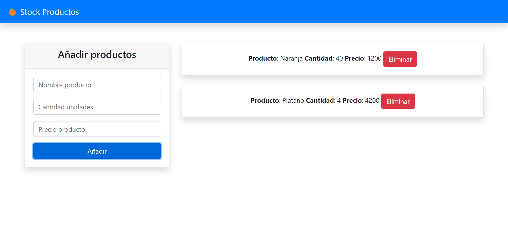

# DOM PRODUCTS JS

## Tecnologías

[](https://html.spec.whatwg.org/multipage/)
[](https://developer.mozilla.org/es/docs/Web/JavaScript)
[](https://getbootstrap.com/docs/4.6/getting-started/introduction/)


## Crear la estructura básica del html

Lo primero es tener una estructura básica HTML. El siguiente fragmento de código ya tiene vinculado los archivos de [Bootstrap 4.6](https://getbootstrap.com/docs/4.6/getting-started/introduction/), el script **App.js** en el cuál vamos a trabajar y algunos componentes como el [**Navbar**](https://getbootstrap.com/docs/4.6/components/navbar/), el formulario en una [**Card**](https://getbootstrap.com/docs/4.6/components/card/)

```html
<!DOCTYPE html>
<html lang="en">

<head>
    <meta charset="UTF-8">
    <meta http-equiv="X-UA-Compatible" content="IE=edge">
    <meta name="viewport" content="width=device-width, initial-scale=1.0">
    <title>Dom Products JS</title>
    <!-- bootstrap CDN -->
    <link rel="stylesheet" href="https://cdn.jsdelivr.net/npm/bootstrap@4.6.0/dist/css/bootstrap.min.css"
        integrity="undefined" crossorigin="anonymous">
</head>

<body>
    <!-- NAVIGATION -->
    <nav class="navbar navbar-light bg-primary shadow">
        <a href="#" class="navbar-brand text-light">🍊 Stock Productos</a>
    </nav>
    <div class="container">
        <div id="App" class="row pt-5">
            <div class="col-md-4">
                <div class="card shadow">
                    <div class="card-header">
                        <h4 class="text-center">Añadir productos</h4>
                    </div>
                    <form id="product-form" class="card-body" autocomplete="off">
                        <!-- name input -->
                        <div class="form-group">
                            <input type="text" class="form-control" id="name" placeholder="Nombre producto">
                        </div>
                        <!-- quantity input -->
                        <div class="form-group">
                            <input type="number" class="form-control" id="quantity" min="1" max="100"
                                placeholder="Cantidad unidades">
                        </div>
                        <!-- price input -->
                        <div class="form-group">
                            <input type="text" class="form-control" id="price" placeholder="Precio producto">
                        </div>
                        <input type="submit" value="Añadir" class="btn btn-primary btn-block">
                    </form>
                </div>
            </div>
            <div id="product-list" class="col-md-8">
            </div>
        </div>
    </div>
    <!-- scripts  -->
    <script src="App.js"></script>
</body>

</html>
```

## Desarrollar la funcionalidad en Javascript

En el archivo **App.js** vamos a escribir código en **ES6** que soporta la sintaxis de clases.

### Definir la clase Products

Esta clase va incluir las propiedades **name**, **quantity** y **price** en el método **constructor**:

```js
class Products {
	constructor(name, quantity, price){
		this.name = name;
		this.quantity = quantity;
		this.price = price;
	}
}
```

### Clase UI

Luego vamos a crear una clase **UI** que incluirá los métodos para manipilar el **DOM** en el html y mostrar los nuevos productos:

```js
class UI {
	addProduct(){
		const listProducts = document.getElementById('product-list');
		const element = document.createElement('div');
		element.innerHTML = /*HTML*/ `
		<div class="card text-center mb-4 shadow">
			<div class="card-body">
				<strong>Producto</strong>: ${product.name}
				<strong>Cantidad</strong>: ${product.quantity}
				<strong>Precio</strong>: ${product.price}
				<a href="#" class="btn btn-danger" name="delete">Eliminar</a>
			</div>
		</div>
		`;
		listProducts.append(element);
	}
}
``` 

## Demo

[](https://enidev911.github.io/javascript-workbench/dom-products-js/)
